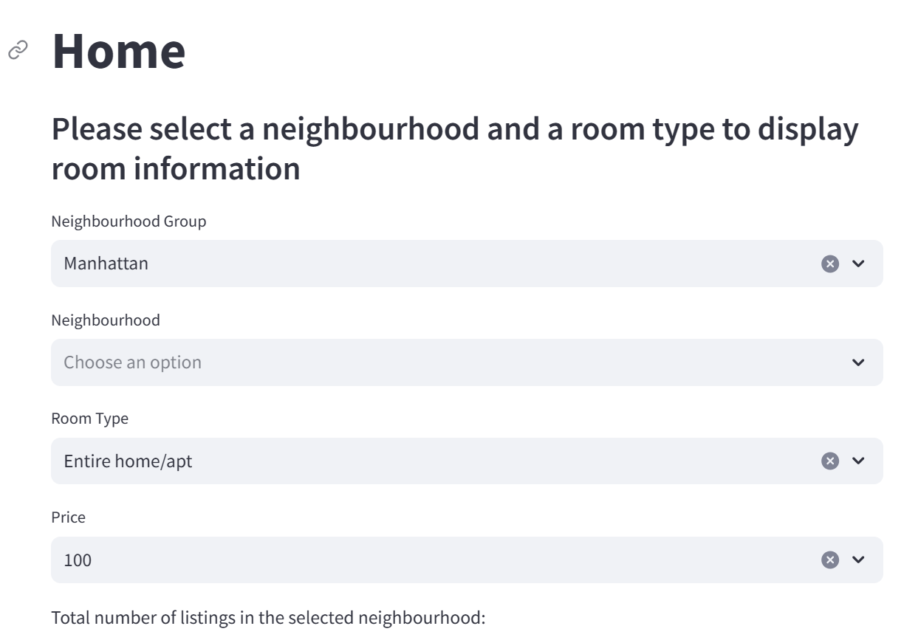

# Testing

### Why the neighbourhood selection module might produce an unexpected error
The provided NeighbourhoodSelectorTest class is a valuable component of the testing suite for the NeighbourhoodSelector module. This feature is at the centre stage of our Airbnb dashboard.

1. The test_set_selection_neighbourhood method tests the **set_selection method** of NeighbourhoodSelector. It checks if selecting the neighbourhood 'Williamsburg' correctly filters the DataFrame to include only the relevant entries. The assertEqual statement compares the output to the expected list of names, and if they don't match, it raises an error with the provided message.

2. The test_set_selection_room_type method tests the **set_room_type method**. It checks if selecting the room type 'private room' correctly filters the DataFrame to include only relevant entries. The assertEqual statement compares the output to the expected list of names, and if they don't match, raises an error.
he provided NeighbourhoodSelectorTest class is a valuable component of the testing suite for the NeighbourhoodSelector module. This feature is at the centre stage of our Airbnb dashboard.

3. The test_get_neighbourhoods method calls **get_neighbourhoods** and checks if it returns the correct list of unique neighborhoods. The assertEqual statement compares the method’s output to the expected list of neighborhood names. If they don't match, it raises an error with the specified message.

4. The test test_set_selection_impossible method tests the behavior of the **set_selection method**. It can handle cases where the specified filters (neighbourhood, room type, and price) do not match any entries in the dataset. It is important to verify that the method can handle such scenarios well without errors and return the expected result.
The test checks if the filter logic correctly identifies that there are no entries matching the given criteria. Specifically, it verifies that filtering for neighbourhood='Williamsburg', room_type='Private room', and price=0 results in an empty selection, as there are no rooms in Williamsburg with a private room priced at 0 in the sample dataset.

### Why this test class is valuable
#### Ensures correct functionality:
The NeighbourhoodSelectorTest class ensures that the NeighbourhoodSelector clas works as expected. By validating its functions, the test class helps maintain the reliability of the code, catching errors early in the development cycle.

#### Facilitates refactoring:
With a solid suite of tests, developers can confidently refactor and improve the NeighbourhoodSelector codebase. The tests provide a safety net that quickly identifies if any changes break existing functionality.

#### Documents expected behavior:
The tests serve as a form of documentation, showing how the NeighbourhoodSelector is supposed to behave in different scenarios. This can be particularly useful for new developers joining the project or when revisiting the code after some time.

#### Automates testing:
Automated tests save time and effort by enabling continuous integration and continuous deployment (CI/CD) practices. Every change in the codebase can be automatically tested, ensuring consistent quality.
